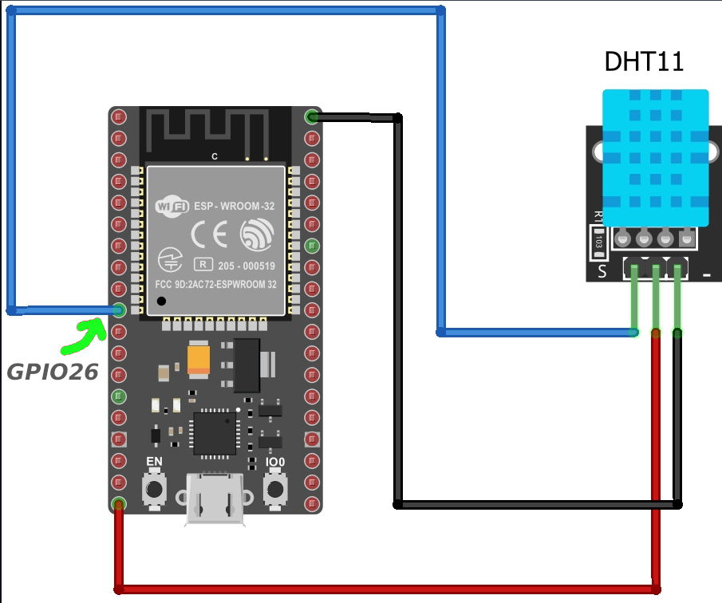

# ESP32 DHT11 Web Server 🌡️💧  

This project demonstrates how to interface a **DHT11 Temperature & Humidity sensor** with an **ESP32** and host a simple web server to display live sensor readings.  

The ESP32 reads temperature and humidity values from the DHT11 sensor and serves them via a web page, which auto-refreshes every 4 seconds.  

---

## 📌 Features  
- Reads **Temperature (°C)** and **Humidity (%)** from DHT11  
- Hosts a **Web Server** on ESP32 accessible via local WiFi  
- Auto-refreshing web page with clean UI  
- Uses **ESP32 GPIO26** as the DHT11 data pin  

---

## 🖼️ Circuit Diagram  
  
- **ESP32 GPIO26 → DHT11 Data (S)**  
- **3.3V → VCC**  
- **GND → GND**  

---

## ⚡ Requirements  
- ESP32 board  
- DHT11 Sensor module  
- Jumper wires  
- Arduino IDE with:  
  - **ESP32 Board support**  
  - **DHT Sensor Library**  

---

## 📂 Code Overview  

- `DHT dht(26, DHT11);` → Sets GPIO26 as the data pin  
- Connects ESP32 to WiFi  
- Starts a Web Server at port `80`  
- Displays sensor values
---
